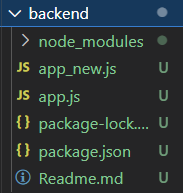

# Readme

目錄：

- [x] 1. 觀察 package.json 的變化
- [x] 2. 觀察 node_modules 裡面有什麼
- [x] 3. package.json 中的 dependencies vs .devDependencies 
- [x] 4. package.json 中的 scripts 這個區塊怎麼用
- [x] 5. Port number 要怎麼以環境變數來設定
- [x] 6. 哪些檔案應該要被放上 github repo 
- [ ] 7. CJS vs ESM，這兩者分別怎麼用
## 1. 觀察 package.json 的變化
在 /backend 中執行 `npm init` 後，產生 package.json，其內容如下：

```json
{
  "name": "backend",
  "version": "1.0.0",
  "description": "在 /backend 中進行 `npm init`、 `npm install express` 後：",
  "main": "index.js",
  "scripts": {
    "test": "echo \"Error: no test specified\" && exit 1"
  },
  "author": "",
  "license": "ISC"
}
```

接著執行 `npm install express` 後的變化：

```json
{
  "name": "backend",
  "version": "1.0.0",
  "description": "在 /backend 中進行 `npm init`、 `npm install express` 後：",
  "main": "index.js",
  "scripts": {
    "test": "echo \"Error: no test specified\" && exit 1"
  },
  "author": "",
  "license": "ISC",
  "dependencies": {
    "express": "^4.21.0"
  }
}            
```
差異在後者多了：
```json
"dependencies": {
    "express": "^4.21.0"
  }
```

為甚麼？

原因：

- 新增了 "dependencies" 欄位，並在其中列出了 "express": "^4.21.0" 這是表示安裝了版本是 4.21.0 的 express 套件。

- 在執行`npm install express`去安裝套件時，npm 會自動更新 `pakage.json` 文件，將該套件及版本加入 `dependencies` 中，確保專案在有重新安裝的需求時，會自動安裝正確版本的 express，以及其他已經安裝的依賴項目。

## 2. 觀察 node_modules 裡面有什麼？

Ans：

可以觀察在安裝 `express` 這個套件的同時， `node_modules` 資料夾也自動下載了許多不同的幫手程式，這些都是 express 需要用到的工具，也就是其依賴的其他模組。

而模組之間同樣也還會有彼此的依賴，故產生了遞歸的依賴樹結構，使在下載單一模組 `express` 後，`node_modules` 資料夾卻包含了非常多模組。

## 3. package.json 中的 dependencies 與 devDependencies 分別是什麼？

### `dependencies`
- **用途：** `dependencies` 是專案在生產環境中運行時所需要的必備套件。
  
  例如，在我的 `package.json` 中，`"express": "^4.21.0"` 就是一個 `dependencies`，因為 `express` 是應用程式在運行時所需的套件。

- **使用場景：** 當應用程式部署到伺服器或生產環境中時，所有列在 `dependencies` 中的套件都會被安裝，以確保應用程式能夠正常運行。

- **安裝方法：** 當你使用 `npm install <package>` 指令安裝套件時，它會被自動加入 dependencies。

### `devDependencies`

- **用途：** `devDependencies` 是開發階段所需要的工具和套件，但在應用程式最終運行時並不需要，所以通常於輔助開發、測試或編譯程式碼。

- **使用場景：** 用於開發、測試和建構應用程式階段，而不會在最終運行時使用。使開發者能夠更高效地編寫、測試和維護應用程式。

- **安裝方法：** 使用 `npm install nodemon --save-dev` 指令，安裝的套件會被自動加入 `devDependencies`中。

#### Ｑ：為甚麼我的 package.json 沒有 `devDependencies`?
Ans：因為我的專案只安裝了 express，它是運行時的依賴，因此被加入了 dependencies。

如果我沒有安裝任何開發時才需要的工具，那麼 devDependencies 就會是空的或不存在。

只有在安裝專門為開發使用的工具時，devDependencies 這個欄位才會出現並有內容。

## 4. package.json 中的 scripts 這個區塊怎麼用

在 `package.json` 中，`scripts` 區塊允許我們定義自訂的命令，可以幫助自動化各種任務，例如編譯、測試、啟動伺服器等。

| 功能                 | 說明                                                                 | 範例                                                               |
|----------------------|----------------------------------------------------------------------|--------------------------------------------------------------------|
| 定義自訂腳本          | 在 `scripts` 區塊中定義自訂的腳本來執行各種命令，格式為鍵值對。            | `{"scripts": {"build": "node build.js"}}`                           |
| 執行腳本              | 使用 `npm run <script-name>` 來執行定義的腳本，例如 `npm run build`。   | `npm run build`                                                     |
| npm 預設支持的腳本     | npm 提供預設的腳本，如 `start` 和 `test`，可以直接執行 `npm start` 或 `npm test`。 | `npm start, npm test`                                               |
| 傳遞參數              | 腳本中可以傳遞參數，方式為 `npm run <script-name> -- <參數>`。         | `npm run build -- --prod`                                           |
| 支持 Shell 指令       | 支持所有 Shell 指令，像 `rimraf`、`cp` 等工具都能通過 `npm script` 執行。 | `{"scripts": {"clean": "rimraf dist/"}}`                            |
| 鉤子 (Hooks)          | 可以定義 `pre` 和 `post` 鉤子，在某些腳本之前或之後自動執行對應腳本。     | `{"scripts": {"prebuild": "echo Before build", "build": "node build.js", "postbuild": "echo After build"}}` |

## 5. Port number 要怎麼以環境變數來設定？
修改前：
```javascript
const express = require('express');
const app = express();

// port number 寫死在程式碼中
const port = 3000;

app.get('/', (req, res) => {
  res.send('Hello World!');
})

app.listen(port, () => {
  console.log(`Server is listening on port ${port}`);
})
```
修改後：
```javascript
const express = require('express');
const app = express();

// 使用 process.env.PORT 環境變數，如果沒有設定，預設為 3000
const port = process.env.PORT || 3000;

app.get('/', (req, res) => {
  res.send('Hello World!');
});

app.listen(port, () => {
  console.log(`Server is listening on port ${port}`);
});
```

在修改後的程式碼中，`Node.js`將會使用`PROCESS.ENV.PORT`的值作為 port number。

如果沒有設置，它將會使用預設的 port number 3000 來運行應用程式。這種方法可以確保 Node.js 應用程式可以在多台伺服器上運行，而不需要更改程式碼檔案或設定檔。

## 6. 哪些檔案應該要被放上 github repo 


- 應該上傳的檔案：
  
  - `app.js`、`app_new.js`：主程式檔案。
  
  - `package.json`：這個檔案包含了專案所需的依賴關係與腳本，是 Node.js 專案中非常重要的檔案，應該上傳。
  
  - `Readme.md`：這包含了專案有關的說明與文件，這所以該上傳。

- 不該上傳的檔案：
  - `node_modules 資料夾`：雖然包含了所有的 npm 模組，但不應該上傳到 GitHub。因為其他開發者可以自己透過 npm install 根據 package.json 安裝依賴模組。
  
- 不確定：
  - ` package-lock.json`：在想要鎖定確切的依賴版本的時候，上傳這個檔案，能確保其他人安裝相同版本的依賴。

**Ｑ：怎麼做才能忽略不該上傳的檔案？**

Ans：在專案的跟目錄下建立 `.gitignore`檔案，內容如下： 
```gitignore
# 忽略 node_modules 資料夾
node_modules/

# 忽略 .env 檔案（通常包含環境變數，如 API keys 或資料庫密碼）
.env
```
## 7. CJS vs ESM，這兩者分別怎麼用？
