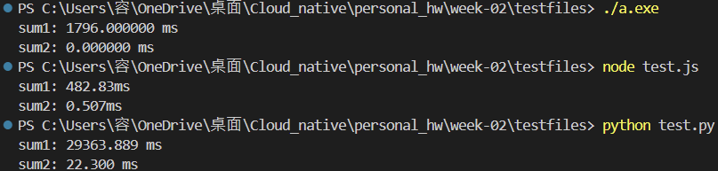
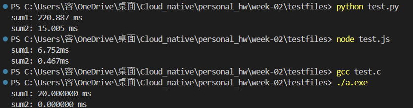

[補充] 測試程式
===
## 思考 1：
### (1) 時間複雜度的定義跟實際場景遇到的情況是否一致？實際場景上會一直需要從 1 加到很大的數字嗎？

`理論上的時間複雜度：`

- sum1 是 O(n)：因為它需要迴圈來從1加到n。
- sum2 是 O(1)：只需數學算式來計算總合，為 *constant time*。

`實際場景情況：`
- 從 1 加到很大的數字的需求應該不多
： 進行計算大量資料的總和、處理統計數據或累計時間序列中的值等等的情況時，sum1 的 O(n) 可能會影響效能，不過通常數據會更為複雜，不會做這種單純操作，故判斷此需求不多。

`測試結果vs現實需求：`

- Node.js：JS的 V8 引擎對簡單迴圈做了優化，因此`sum1`大約花費 482 ms，而`sum2`同樣也很快。

- C 語言：`sum1`花費了約 1796 ms，`sum2`幾乎瞬間完成。我認為這符合 C 的低層性能表現，能顯著提高迴圈處理的效能。

- Python：`sum1`花費了 29363 ms，而`sum2`較快完成。可能是因為 Python 的迴圈性能不如編譯型語言，更何況`sum1`是 O(n) 複雜度。

## 思考 2：
### 對 CPU 的設計來說，加法 vs 乘法、除法，是否有效能上的差異?
1. **加法**
：CPU 內部有專用的加法器，運算非常簡單，能在 1 個時鐘週期內完成，因此加法最快。

2. **乘法**
：現代 CPU 配備了專用的乘法器，允許快速進行乘法操作，儘管比加法複雜，但由於硬體支援，乘法效率仍然很高。

3. **除法**
：除法的過程涉及計算商和餘數等多種步驟，而大多數 CPU 沒有專用的除法器，因此必須依賴多次減法和加法來完成，耗費較多時鐘週期，故效率最低。

## TODO 1：
### (1) 每次都是從 1 加到 10000，這樣的測試結果準確嗎？(2) 不同的程式語言結果一樣嗎？(3) OS 在 CPU 的處理上，會不會有 cache?

**(1)** 雖然跑出程式執行的時間，但我認為不一定是準確的表現。
因為
：
- **數值範圍**：測試一直使用相同範圍的數字 n=10000，會產生相同的計算結果，因此 CPU 可能會進行某些優化，例如進行記憶體的暫存 (cache)，導致無法判斷程式真實的效能差異。

- **迴圈重複**：計算多次相同的迴圈後，對於計算速度很快的公式`sum2`，可能會因為 CPU cache 而加快運算速度。因此測試次數過高反而可能掩蓋不同算法之間的差異。

**(2)** 不同程式語言不完全一樣，如前面所附的三種不同程式語言的時間計算結果去推論原因可能為：
- **語言的運行環境**：C 語言是編譯語言，速度通常較快；而 Python 和 JavaScript 是直譯語言，需step-by-step去直譯為機器碼，因此相對較慢。

- **內建函數優化**：不同語言針對數學運算、迴圈和暫存等操作的底層優化不同，C 語言的低層次優化相較於 Python 會更高效。

**(3)**：會。OS 和 CPU 都會使用多層次的 cache 機制來加速計算，特別是當程式反覆執行相同的操作時，cache 可以顯著減少訪問記憶體的次數，加快運行速度。而在此次測試中，每次執行的計算都是固定的 1+2+⋯+10000，因此 CPU 很可能會將這些數值或結果存入 cache，導致後續的運算速度更快，這也會影響測試的準確性。

要避免這種情況，可以嘗試改變使用亂數n，來排除 cache 的干擾。

## TODO 2：
#### 換成小一點的數字，結果如何？

- **迴圈內的執行時間變短**：因為計算的數值變小，執行時間自然縮短，這在`sum1`中相較明顯，因為它是逐步累加的迴圈。

- **總體運行時間差異縮小**：`sum2`的時間複雜度為常數時間 O(1)，無論 n 多小或者多大，它的時間花費都相對固定。而`sum1`的時間複雜度為 O(n)，因此數字變小後，兩者的時間差異會縮小。

- **CPU cache 影響減小**：使用較小的數字時，cache 的影響會減少，特別是對於小範圍數字的計算，cache 不會頻繁觸發。這會讓結果更接近真實的執行時間。